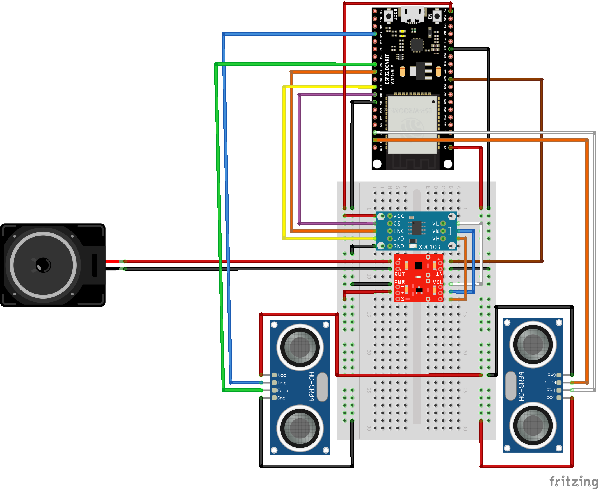

# autodigimin
My Digital Theremin Project

Here is the code and wiring diagrame for the digital theremin project, with autotune.  The required parts are a ESP32 development board to generate tones and generally control things, two HC-SR04 ultrasonic sensors to determine positions of hands to determine tone and volume, a X9C103S digital potentiometer to control volume, a Sparkfun TPA2005D1 amplifier to make things audible, and an 8 ohm speaker to play the tones.

The locations of libraries used to make it work are in the comments in the <A href="autodigimin.ino">code</a>.

The wiring diagram is as follows:

The finished article should look a bit like this:

And sound a bit <A href="IMG_1182%201.mov">like this</a>
